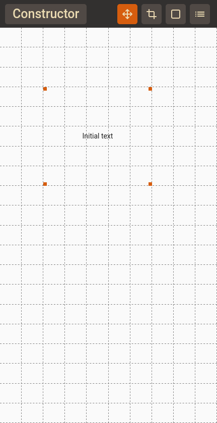
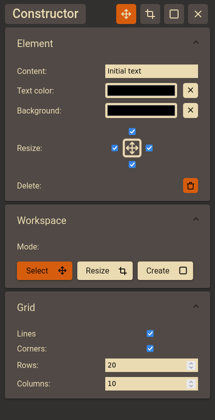
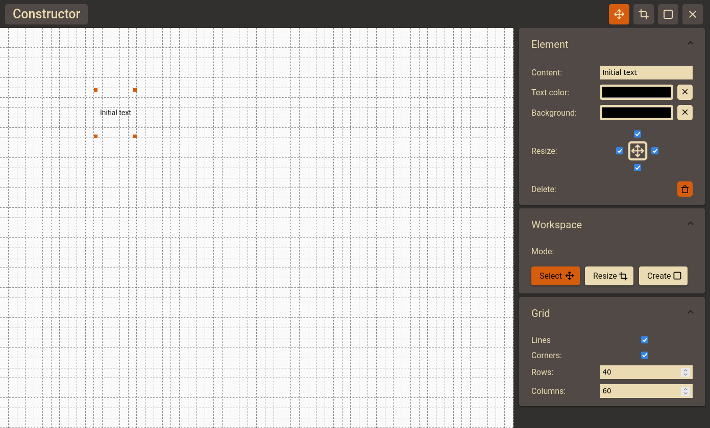

# Constructor

Visual grid based editor.

## How to run? 
Require docker-compose and make.

    make 

Or check deployed version [Link](https://constructor-app.herokuapp.com/):
* https://constructor-app.herokuapp.com/ (May take long time if server in sleep state.)

## What does ?
* Dataflow based on RxJs
* Support touch and mouse interface
* Changing grid properties
* Element manipulation
* Websocket connection
* Work without websocket
* Websocket auto-reconnect
* Work with databse and server
* Database data auto-removing with timeout

## Screenshots

### Mobile

 

### Desktop:

